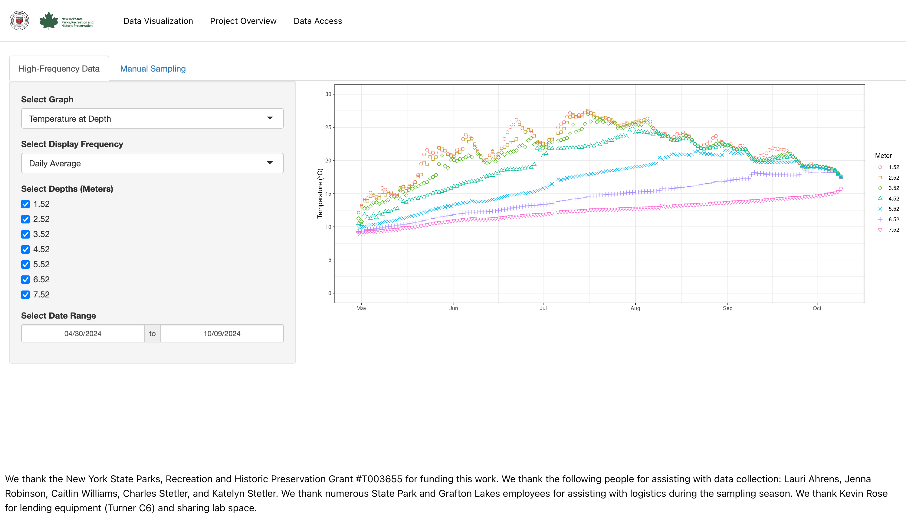

# Research Project Website

This project provides a website showcasing a research project focused on environmental data collection from Long Pond 
in Grafton Lakes State Park. It includes interactive visualizations powered by a Shiny app and pages with detailed 
information about the project and how to access the data.



## Features

- **Main Page:** Features a Shiny app displaying interactive visualizations.
- **Project Overview Page:** Provides detailed information about the project's purpose, including images and descriptions of the lake and research process.
- **Data Page:** Includes a citation for the research and a link to access the dataset on the EDI data portal.

## How to Run Locally

1. Clone the repository:
   ```bash
   https://github.com/EnvironmentalWebApplication/Website.git

2. Navigate to the project directory:
   ```bash
   cd Website

3. Install the necessary dependencies:
   ```bash
   npm install

4. Install the necessary dependencies:
   ```bash
   npm run dev